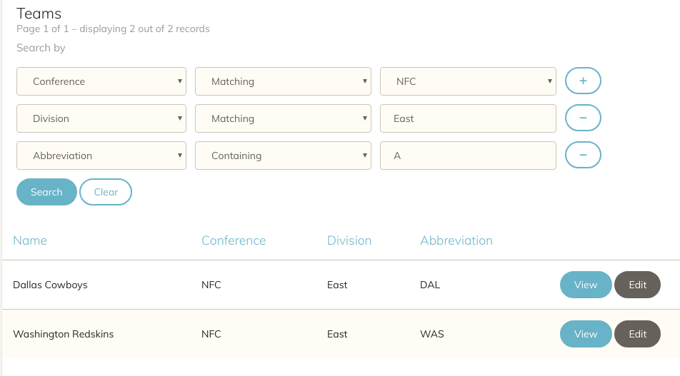
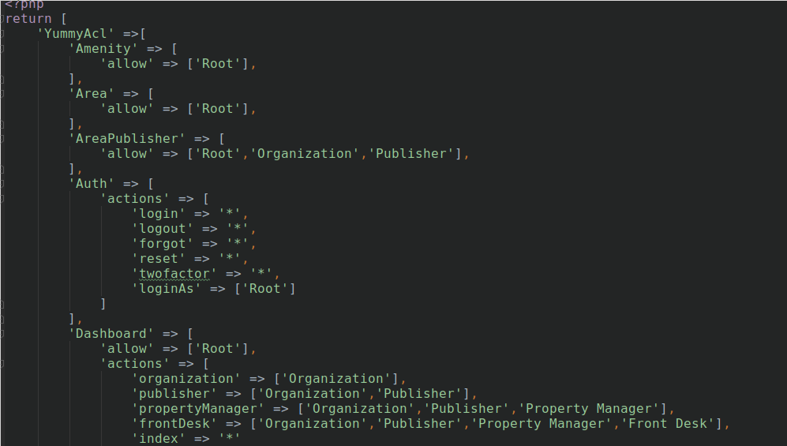

# Yummy plugin for CakePHP

[](LICENSE.txt)
[](https://codeclimate.com/github/cnizzardini/cakephp-yummy)
[](https://codeclimate.com/github/cnizzardini/cakephp-yummy)

A delightfully tasty plugin for your CakePHP 3 project including a group-based 
Access Control List (ACL), a search component with an intuitive user-interface, 
and boostrap 3 Bake Themes. Each of these components may be used separately.

## Demo & Docs

[Live Demo available](https://cnizz.com/yummy-demo) and fully documented in the [git wiki](https://github.com/cnizzardini/cakephp-yummy/wiki).

## Supported Versions

| Version  | Supported | Unit Tests | Notes |
| ------------- | ------------- | ------------- | ------------- |
| 4.0 | No  | Failing | See cake-4.0 branch, this is a work in progress |
| 3.8 | Yes  | Passing | - |
| 3.7 | Yes  | Passing | Tested |
| 3.6 | Yes  | Passing | - |

Note, unit tests fail on 3.5 and lower. Unit tests were ran against CakePHP `4.0.0-beta3` 
and failed.

## Features

### [YummySearch](https://github.com/cnizzardini/cakephp-yummy/wiki/Yummy-Search)

A search component designed to work with CakePHPs Paginator Component and Cake\ORM\Query. It supports searching the 
base model and other associations such as HasOne, BelongsTo, and HasMany through an intuitive UI in just three easy steps.



```php
// Step 1. Basic Controller Usage:
$query = $this->ModelName->find();

$this->loadComponent('Yummy.YummySearch',[
    'query' => $query,
    'allow' => [
        'Table.column' => ['name' => 'Column Name'],
    ]
]);

$results = $this->paginate($this->YummySearch->search($query));

// Step 2. Basic View Usage:
$this->helpers()->load('Yummy.YummySearch');
echo $this->YummySearch->basicForm();

// Step 3. Include agnostic JavaScript
<script src="/yummy/js/yummy-search.js"></script>
 
```

Check out the [documentation](https://github.com/cnizzardini/cakephp-yummy/wiki/Yummy-Search) for advanced 
usage and customization. 

### [YummyAcl](https://github.com/cnizzardini/cakephp-yummy/wiki/Yummy-ACL)

A component that works with Auth to add group-based access controls to your admin portal.



```php
// Basic Usage
$this->loadComponent('Yummy.YummyAcl',[
    'group' => $this->Auth->user('group'),
]);

// Define ACLs (you can also define ACLs in a single config file)
$this->YummyAcl->actions([
    'login' => '*', // allow all 
    'view' => ['Admin','Manager'], // allow Admin + Manager
    'edit' => ['Admin'], // allow Admin
]);
```

Check out the [documentation](https://github.com/cnizzardini/cakephp-yummy/wiki/Yummy-ACL) for advanced 
usage and customization. 


### YummyBake

A series of bootstrap admin themes for your admin portal [(demo)](https://cnizz.com/yummy-demo/teams)

```
bin/cake bake template <ControllerName> -t Yummy
```

## Installation

You can install this plugin into your CakePHP application using [composer](http://getcomposer.org).

The recommended way to install composer packages is:

```
composer require cnizzardini/cakephp-yummy
```

Load the plugin in: `config/bootstrap.php`

```
Plugin::load('Yummy', ['bootstrap' => false, 'routes' => true]);
```

In newer versions of cake load the plugin via your `src/Application.php` file.

## Documentation

Checkout the [Wiki](https://github.com/cnizzardini/cakephp-yummy/wiki/).

You can also view the source code for demo project on github:

[https://github.com/cnizzardini/cakephp-yummy-demo](https://github.com/cnizzardini/cakephp-yummy-demo)

## Unit Testing
```
vendor/bin/phpunit 
```

## Developers

Fork and send a pull request. You can include Yummy in your Cake project 
as a local source to make developing easier use these steps:

- Remove `cnizzardini\cakephp-yummy` from your `composer.json`

- Add a paths repository to your `composer.json`
```
"repositories": [
    {
        "type": "path",
        "url": "/absolute/local-path-to/cakephp-yummy",
        "options": {
          "symlink": true
        }
    }
]
```
- Run `composer require cnizzardini/cakephp-yummy @dev`

Undo these steps when you're done. Read the full composer documentation 
on loading from path here: [https://getcomposer.org/doc/05-repositories.md#path](https://getcomposer.org/doc/05-repositories.md#path)